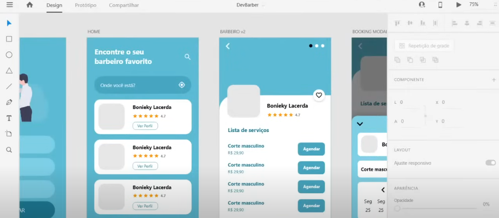

# AGENDAMENTO PARA BARBEIROS
👨‍🏫ESTE APP AJUDA OS USUÁRIOS A ENCONTRAR BARBEIROS PRÓXIMOS COM BASE EM SUA LOCALIZAÇÃO OU ENDEREÇO INFORMADO.

 <br>

## DESCRIÇÃO:
Este app ajuda os usuários a encontrar barbeiros próximos com base em sua localização ou endereço informado. Ele permite que os usuários:

1. **Registrar-se** (nome, e-mail, senha) ou **fazer login**.
2. **Pesquisar barbeiros** por localização ou nome.
3. **Marcar favoritos** e visualizar sua lista de favoritos.
4. **Agendar horários** com barbeiros.
5. **Visualizar agendamentos** anteriores e futuros.
6. Atualizar a localização manualmente ou usar o GPS.

## EXECUTANDO O PROJETO:
1. **Instalar as dependências do projeto**:  
   - No diretório do projeto, abra o terminal ou prompt de comando e execute:  
     ```bash
     npm install
     ```  
     Este comando instalará todas as dependências listadas no arquivo `package.json` do projeto.

2. **Iniciar o servidor do Expo**:  
   - Ainda no diretório do projeto, inicie o servidor do Expo com:  
     ```bash
     npm start
     ```  
     Esse comando abrirá a interface do Expo no navegador, permitindo que você escolha como deseja executar o aplicativo (em um emulador, dispositivo físico ou navegador).

3. **Executar o aplicativo em um dispositivo ou emulador**:  
   - **Dispositivo físico**:  
     - Instale o aplicativo **Expo Go** na Play Store (Android) ou App Store (iOS).  
     - Escaneie o QR Code exibido no navegador pelo Expo para abrir o aplicativo.  
   - **Emulador Android**:  
     - Certifique-se de que o **Android Studio** esteja instalado e o emulador configurado.  
     - Inicie o emulador e pressione `a` no terminal para abrir o app no Android.  
   - **Simulador iOS** (apenas em macOS):  
     - Certifique-se de que o **Xcode** esteja instalado.  
     - Pressione `i` no terminal para abrir o app no simulador iOS.  

4. **Usando App:**
   1. **Login ou Cadastro**:  
      - Ao abrir o app, o usuário deve cadastrar-se ou fazer login.
      
   2. **Encontrar Barbeiros**:
      - Insira o endereço ou clique no ícone de localização para usar o GPS.
      - O app buscará barbeiros próximos e exibirá uma lista.

   3. **Selecionar Barbeiro**:
      - Clique no barbeiro para ver detalhes, serviços e opções para marcar horário.

   4. **Marcar Horário**:
      - Escolha um serviço, data e hora disponíveis.

   5. **Favoritar Barbeiros**:
      - Adicione barbeiros à lista de favoritos para acessá-los mais facilmente.

   6. **Gerenciar Agendamentos**:
      - Veja e organize seus horários marcados.

   7. **Atualizar Localização**:
      - Use o campo de texto para inserir um endereço manualmente ou clique no ícone de GPS para localizar-se automaticamente.

## NÃO SABE?
- Entendemos que para manipular arquivos em `HTML`, `CSS` e outras linguagens relacionadas, é necessário possuir conhecimento nessas áreas. Para auxiliar nesse aprendizado, oferecemos cursos gratuitos disponíveis:
* [CURSO DE REACT NATIVE](https://github.com/VILHALVA/CURSO-DE-REACT-NATIVE)
* [CURSO DE JAVASCRIPT](https://github.com/VILHALVA/CURSO-DE-JAVASCRIPT)
* [CURSO DE NODEJS](https://github.com/VILHALVA/CURSO-DE-NODEJS)
* [CONFIRA MAIS CURSOS](https://github.com/VILHALVA?tab=repositories&q=+topic:CURSO)

## CREDITOS:
- [VEJA O VIDEO DESSE PROJETO](https://www.youtube.com/live/kk_pGWBOkc4?si=bEyEiRKreG5a7Jvt)
- [PROJETO FEITO PELO VILHALVA](https://github.com/VILHALVA)


